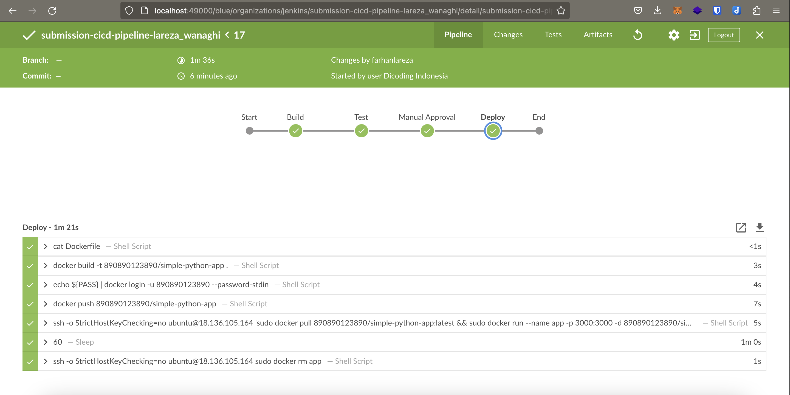

# simple-python-pyinstaller-app

This repository is dedicated to completing the "Proyek Membangun CI/CD Pipeline dengan Jenkins" assessment from the [Belajar Implementasi CI/CD](https://www.dicoding.com/academies/428) course provided by Dicoding Indonesia.

## Scope of Work

The scope of work for this project is focused on the **'Jenkinsfile'** and **'Dockerfile'** files located in the root directory.

### Jenkinsfile

The **'Jenkinsfile'** sets up a CI/CD pipeline consisting of four stages as shown below. 

Prior to executing a stage, it retrieves the relevant repository data. Each stage performs specific actions outlined below:

- **Build:**
This stage compiles the Python code located in the **'source'** folder using the `py_compile` module.

- **Test:**
Following the completion of the build stage, this step performs testing using the `pytest` framework on the **'test_calc.py'** script located in the **'source'** folder.

- **Manual Approval:**
This stage halts the pipeline and waits for manual approval before proceeding further.

- **Deploy:**
The Deploy stage begins by building and pushing a Docker image using the **'Dockerfile'** in the root directory. It then establishes an SSH connection to an EC2 instance and runs a Docker container using the previously built image. After the container completes its execution and stops, a 60-second delay is introduced before proceeding. Once the delay is complete, the pipeline reconnects to the EC2 instance and removes the previously created container.

### Dockerfile

The **'Dockerfile'** is responsible for making a docker image that runs the Python app in the **'source'** folder. It leverages the `PyInstaller` tool to generate an executable file for the Python app and subsequently executes the generated executable file to simulate the app's functionality.